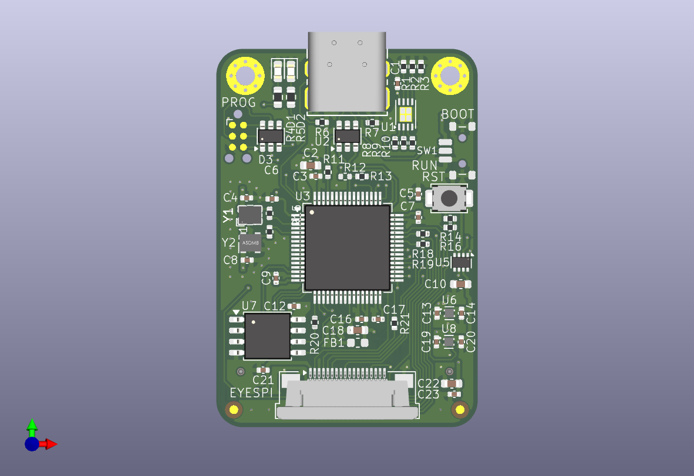

# STM32G4_SOM
STM32G473 SYSTEM ON MODULE

This project is a straightforward STM32 based system on module for use in my various projects.

Features:
- MCU: STM32G473VET6, populated with G474RC due to parts availability
- 128Mbit QSPI onboard flash memory
- 32.678kHz and 8MHz MEMS oscillators
- USB interface
- Power path selection from USB 5V and 5V from mezzanine connector
- 5V to 3.3V LDO, separate LDO for 3.3VA, with select at assembly options for a single regulator or alternate package
- 2x onboard LEDs
- 1x on board temperature sensor
- One connector adhering to the Adafruit EYESPI pinout intended for driving displays (Connector is mirrored from typical Adafruit pinout - requires an A-A cable instead of the A-B that Adafruit sells)
- SWD programming on a Tag Connect target pad array

28 Pin Mezzanine connector with configurable IO. Notional initial configuration:
- 1x I2C
- 1x SPI, option for configuration as I2S
- 1x Quadrature encoder
- 1x LPUART
- 2x single ended ADC inputs
- 1x differential ADC input
- 8x GPIO

Current Test Status: 
[x] indicates tested and works fine 
[x] USB power and data input 
[x] 3.3V digital 
[x] boot and reset switches 
[x] Tag Connect pad array 
[x] Temperature sensor. ~5deg C rise above ambient 
[x] Eyespi: SPI works, touch and sd card not tested. No plans to 
[x] onboard LEDs 
[x] Encoder 
[x] GPIO: PF1, PC15, PB11 
[ ] GPIO: PC6, PC5, PC4, PA5 
[ ] ADCs 
[ ] SPI1 
[x] I2C3 
[ ] QSPI Flash 
[ ] Power path from mezzanine 5V 

